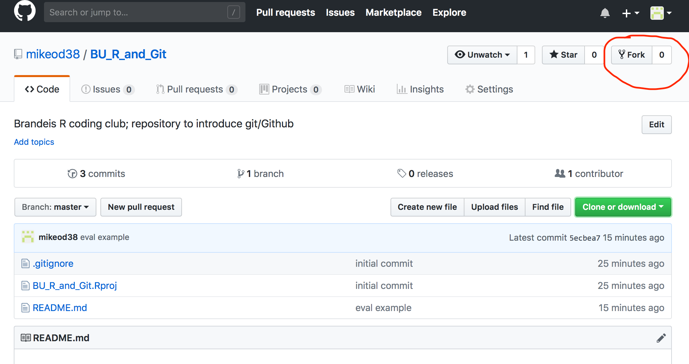

BU\_R\_and\_Git
===============

Brandeis R coding club; repository to introduce git/Github

So I've made this respository to give everyone a chance to try out installing and collaborating using Github. Though I made this in R, this principles are the same for any text-based collaboration and/or version control project.

First thing, make sure you have git installed on your computer, and that you've registered for a Github account. I'd recommend using Jenny Bryan's tutorial as a starting point:

<http://happygitwithr.com>

I standardly use the "New Project Github First"

<http://happygitwithr.com/new-github-first.html>

It's a bit easy to get lost making changes from local to Github so I always start by cloning an already created, empty (except for README.md) Github repo.

To start, this document created from RMarkdown format (README.Rmd), which means you can add code, which can (or not) be evaluated in-line.

For example:

``` r
curve(sin, -2*pi, 2*pi)
```


But that's another story, which can be addressed in an Rmarkdown topic. For now, there's a few things everyone who's interested should do to know they have things up and running correctly. The goal is to simply submit a pull request to edit the document names.txt - adding your name to the file. When you've done it successfully, I'll accept the change in the repository.

So the steps are:

-   set up git on your computer
-   set up a Github account
-   (optional) get a Github GUI - I like GitKraken, but find myself doing all of the git stuff in Terminal, unless I really screw somethign up.
-   fork this repository: <https://github.com/mikeod38/BU_R_and_Git>



-   then clone this repository to a folder you'd like to keep track of git projects

``` r
# in Terminal/shell
$ git clone https://github.com/mikeod38/BU_R_and_Git.git
```

-   next, edit the names.txt document using any text editor (NOT MS WORD) to add your name.

``` r
Mike O'Donnell
(your name here)
```

-   then you need to talk to git to tell it you'd like to "stage", then "commit" your changes:
